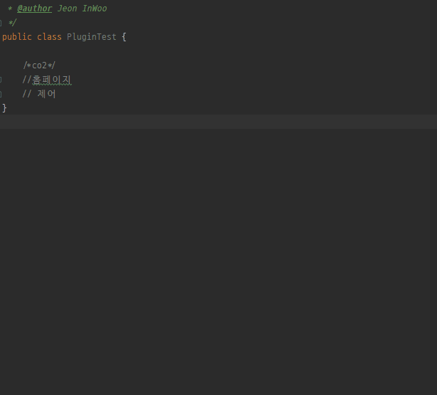
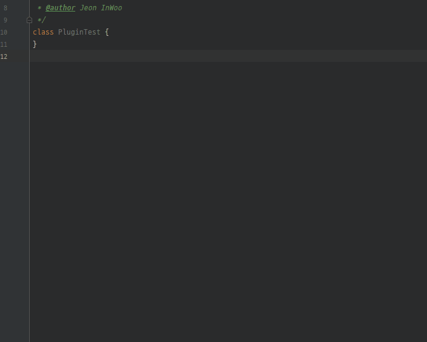

# CustomWordTranslator
- - -


개발중 사용하는 단어에 대한 용어를 매번 찾아보는 일을 최소화 하기 위하여 제작된 플러그인 입니다.   
사용하는 단어는 user.home/.customwordtranslator/ 경로에 customwordtranslator.txt 파일로 저장되어 관리 됩니다.

- 기능
  1. 단일 단어 기능
  2. 단어 편집 기능

### 단일 검색 기능 ```(Ctrl + 1)```
선택한 단어에 대한 용어 검색 기능



### 단어 편집 기능 ```Ctrl + 2```
입력한 단어에 대한 검색 / 추가 / 삭제 / 초기화 기능
- 검색 시 해당 문자가 포함되어 있는 모든 단어에 대한 용어를 검색 합니다.
- 추가 시 입력한 문자의 단어를 생성하며, 이미 용어가 존재할 경우 해당 용어에 덮어 씌여 집니다.
- 삭제 시 맨 위 단어가 삭제 됩니다.
- 초기화 시 최초의 단어목록으로 돌아가며, 적용 버튼을 눌러야 반영됩니다.



## 패치노트

- 0.1
  - 프로젝트 생성
- 0.2
  - 다중 변환기능 단어편집 기능으로 변경
- 0.3
  - 초기 단어목록 수정
- 0.4
  - 단일 검색 기능 편의성 확장
## 참고

1. [Intellij 플러그인 제작 메뉴얼](https://plugins.jetbrains.com/docs/intellij/basics.html)
2. [Intellij 롬복 플러그인](https://github.com/mplushnikov/lombok-intellij-plugin)
3. [이동욱 개발자님의 Translator 플러그인](https://github.com/jojoldu/translator)
4. [Intellij QuickNotes 플러그인](https://github.com/jrana/quicknotes)